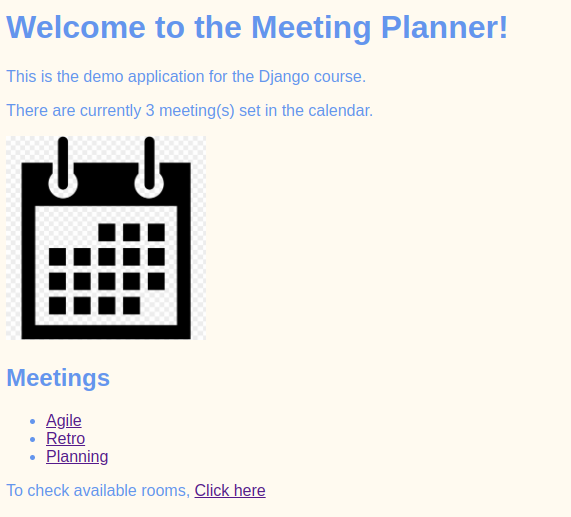
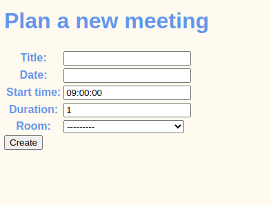

# django-ps-meeting-planner

## Description
Simple meeting planner from Pluralsight course Django - Getting started

- Type: Full-stack web development
- Source: https://app.pluralsight.com/library/courses/django-getting-started/table-of-contents
- Date: September/2022

## How to run
- pip install requirements.txt
- python meeting_planner/manage.py runserver

## What was done:
- django install, creating project, creating apps and basic commands
- MTV - working with models, templates and views
- url link building
- simple styling of web pages
- working with ModelForm
- 
## Status
Simple calendar, view of meeting and rooms, adding entries for 
meetings and rooms in admin, adding entries for meetings

## App screens:
- homepage

- adding new meeting

